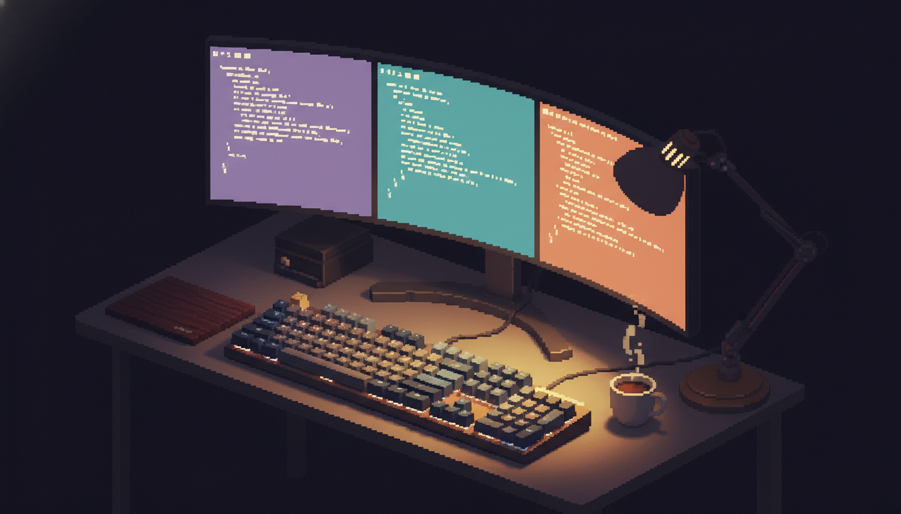

# ULTRA

**ULTRA Lays Tiles Right Away** — a keyboard-driven window manager for macOS, optimized for ultrawide monitors.



## What

Tiling window manager with:

- **Adaptive layouts** - Fixed-pixel for ultrawide, proportional for standard displays
- **Workspaces** - Multi-app presets (coding, comms, web) activated with one key
- **Smart organize** - Cycle through layouts based on window count
- **App launchers** - Quick toggle any app (launch → focus → minimize)
- **Environment-aware** - Supports Different apps for work vs personal

https://github.com/user-attachments/assets/6fa83b02-a90d-4f4c-9125-de99aaf3bae8

## Why

Default macOS window management is mouse-heavy. Previously I've relied on different app combinations for supporting
a small subset of these features. I switched to a Ultrawide monitor recently and gradually started building some of
these features through scripts. Finally, I learned about Hammerspoon and decided to build something that codifies my
workflow in a single place.

This gives you:

- Instant window positioning via keyboard
- Ultrawide-specific layouts (center-focused 860 + 1720 + 860)
- Workspace switching without manually arranging windows
- One key to launch/focus/hide any app

## How

Built with [Hammerspoon](https://www.hammerspoon.org/) — a macOS automation tool using Lua scripts. Hyper key (Caps Lock → Shift+Cmd+Ctrl+Opt) mapped via [Karabiner-Elements](https://karabiner-elements.pqrs.org/).

---

## Visual Overview

### Ultrawide Layout (3440×1440)

```
┌──────────┬──────────────────────┬──────────┐
│   Left   │       Center         │  Right   │
│  860px   │       1720px         │  860px   │
└──────────┴──────────────────────┴──────────┘

Two-thirds splits:
┌─────────────────────────┬──────────┐
│     Left 2/3            │  Right   │
│       2580px            │  860px   │
└─────────────────────────┴──────────┘
```

### Smart Organize (Hyper+\\)

**2 Windows** - cycles 3 configs:

| [1]         | [2]         | [3]               |
| ----------- | ----------- | ----------------- |
| ██░░        | ██░░        | ░░██              |
| Focused 2/3 | Equal 50/50 | Focused 2/3 right |

**3 Windows** - cycles 4 configs:

| [1]            | [2]              | [3]          | [4]               |
| -------------- | ---------------- | ------------ | ----------------- |
| ██░░██         | ██░░░░           | ██░░██       | ░░░░██            |
| Center + sides | Left 2/3 + stack | Equal thirds | Right 2/3 + stack |

**4+ Windows** - cycles 4 configs (focused + stacks)

---

## Features

### Window Positioning

| Key | Layout | Position     | Ultrawide | Standard |
| --- | ------ | ------------ | --------- | -------- |
| `y` | █░░░   | Left 1/3     | 860px     | 1/3      |
| `h` | ██░░   | Left 1/2     | 1720px    | 1/2      |
| `j` | ███░   | Left 2/3     | 2580px    | 2/3      |
| `u` | ░█░    | Center focus | 1200px    | 1/3      |
| `i` | ░██░   | Center       | 1720px    | 1/3      |
| `o` | ████   | Full         | 3440px    | Full     |
| `k` | ░███   | Right 2/3    | 2580px    | 2/3      |
| `l` | ░░██   | Right 1/2    | 1720px    | 1/2      |
| `p` | ░░░█   | Right 1/3    | 860px     | 1/3      |

### Utilities

| Key   | Action                         |
| ----- | ------------------------------ |
| `\`   | Smart organize (cycle layouts) |
| `1`   | Mission Control (all windows)  |
| `2`   | App Exposé (current app)       |
| `3`   | Minimize all (show desktop)    |
| `f`   | Focus mode (center + minimize) |
| `[/]` | Move to left/right display     |
| `4`   | Cycle input source (keyboard)  |
| `r`   | Reload config                  |

### App Launchers

| Key   | App                 |
| ----- | ------------------- |
| `F1`  | Play/Pause          |
| `F2`  | Ghostty             |
| `F3`  | Cursor              |
| `F4`  | Spotify             |
| `F8`  | Slack               |
| `F9`  | Android Studio      |
| `F10` | Obsidian            |
| `F11` | Browser (env-aware) |
| `F12` | WhatsApp            |
| `G`   | Google Meet         |
| `;`   | Msty                |
| `5`   | scrcpy              |

### Workspaces

| Key | Workspace         | Apps                                      | Layout        |
| --- | ----------------- | ----------------------------------------- | ------------- |
| `N` | Comms ↔ Web      | Slack/WhatsApp + Meet + Browser           | 3-way         |
| `M` | Coding ↔ Android | Cursor/Android Studio + Ghostty + Browser | 3-way / 50-50 |

Workspaces auto-minimize non-workspace windows and position apps.

### Environment Detection

Hostname-based detection:

- **Browser**: Chrome (work) / Zen (personal)
- **Communication**: Slack (work) / WhatsApp (personal)

### App-Specific Keys (Obsidian)

When Obsidian is frontmost:

- `Ctrl+hjkl` → Arrow keys (vim nav)
- `Cmd+\`` → Forward delete

---

## Installation

### Prerequisites

- [Hammerspoon](https://www.hammerspoon.org/)
- [Karabiner-Elements](https://karabiner-elements.pqrs.org/) (for Hyper key)

### Setup

```bash
# Clone to ~/.config/ultra
git clone https://github.com/iurysza/ultra ~/.config/ultra

# Run install script (creates bootstrap file)
~/.config/ultra/scripts/install.sh

# Launch Hammerspoon
open -a Hammerspoon

# Grant accessibility permissions when prompted
```

The install script creates a minimal `~/.hammerspoon/init.lua` bootstrap that loads from `~/.config/ultra/`.

### Uninstall

```bash
~/.config/ultra/scripts/uninstall.sh
```

Removes bootstrap and CLI symlink. Optionally deletes config directory.

### Configuration

Copy default config and customize:

```bash
cp ~/.config/ultra/config.default.json ~/.config/ultra/config.json
```

Edit `config.json` to customize:

```json
{
  "launchers": [
    { "key": "F2", "app": "com.mitchellh.ghostty", "name": "Ghostty" },
    { "key": "F11", "appRef": "browser" }
  ],
  "apps": {
    "browser": { "work": "com.google.Chrome", "personal": "app.zen-browser.zen" }
  },
  "workspaces": {
    "comms": { "apps": ["slack", "meet", "browser"], "layouts": ["left", "center", "right"] }
  },
  "environment": {
    "personalHostnamePattern": "your-hostname"
  }
}
```

Config changes auto-reload (no restart needed).

### Karabiner Hyper Key

Add to Karabiner config:

```json
{
  "description": "Caps Lock → Hyper Key",
  "manipulators": [
    {
      "from": { "key_code": "caps_lock" },
      "to": [
        {
          "key_code": "left_shift",
          "modifiers": ["left_command", "left_control", "left_option"]
        }
      ],
      "type": "basic"
    }
  ]
}
```

---

## Bonus: Notifications

tmux-aware macOS notifications with session focusing.

```bash
# CLI usage
notify-claude task-complete "Build done"
notify-claude permission "Approve commit?"
notify-claude error "Tests failed"

# Click notification → focuses exact tmux session:window.pane
```

### Claude Code Integration

```json
// ~/.claude/settings.json
{
  "hooks": {
    "Stop": [{ "type": "command", "command": "notify-claude task-complete" }],
    "Notification": [{ "type": "command", "command": "notify-claude permission" }]
  }
}
```

---

## Development

```bash
# Lint
./scripts/lint.sh

# Format
./scripts/format.sh

# Debug logs
tail -f ~/.config/ultra/debug.log

# Reload
Hyper+R
```

### Editor Support

LuaLS type definitions included in `types/hs.lua`. Works with Neovim/LazyVim out of the box - provides autocomplete and type checking for Hammerspoon APIs.

### Project Structure

```
~/.config/ultra/
├── init.lua              # Entry point
├── config.default.json   # Default configuration
├── config.json           # User configuration (gitignored)
├── src/
│   ├── config.lua        # Config loader with hot-reload
│   ├── keybindings.lua   # Hotkey definitions
│   ├── workspaces.lua    # Workspace presets
│   ├── layouts.lua       # Window layouts
│   ├── app-launcher.lua  # App toggle logic
│   └── ...
└── types/
    └── hs.lua            # LuaLS type stubs
```

---

## Troubleshooting

**Shortcuts not working**:

1. Check Hammerspoon accessibility permissions
2. Verify Karabiner Hyper key mapping
3. Check logs: `tail -f ~/.config/ultra/debug.log`

**Ultrawide detection**:

- Uses aspect ratio ≥ 2.3 (21:9+), not hardcoded resolution

**Config not loading**:

1. Verify bootstrap: `cat ~/.hammerspoon/init.lua`
2. Check JSON syntax: `jq . ~/.config/ultra/config.json`
3. Check logs for errors
4. Reload: Hyper+R

---

## License

MIT
