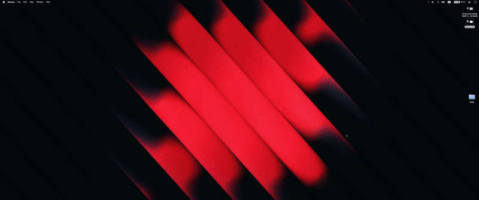

# ULTRA

**ULTRA Lays Tiles Right Away** — a keyboard-driven window manager for macOS, optimized for ultrawide monitors.


## What

Tiling window manager with:

- **Adaptive layouts** - Fixed-pixel for ultrawide, proportional for standard displays
- **Workspaces** - Multi-app presets (coding, comms, web) activated with one key
- **Smart organize** - Cycle through layouts based on window count
- **App launchers** - Quick toggle any app (launch → focus → minimize)
- **Environment-aware** - Supports Different apps for work vs personal



## Why

Default macOS window management is mouse-heavy. Previously I've relied on different app combinations for supporting
a small subset of these features. I switched to a Ultrawide monitor recently and gradually started building some of
these features through scripts. Finally, I learned about Hammerspoon and decided to build something that codifies my
workflow in a single place.

This gives you:

- Instant window positioning via keyboard
- Ultrawide-specific layouts (center-focused 860 + 1720 + 860)
- Workspace switching without manually arranging windows
- One key to launch/focus/hide any app

## How

All shortcuts use **Hyper key** (Caps Lock → Shift+Cmd+Ctrl+Opt via Karabiner).

```
Hyper + J → Position window left 2/3
Hyper + N → Activate Communication workspace
Hyper + \ → Smart organize all windows
Hyper + F2 → Toggle Ghostty terminal
```

---

## Visual Overview

### Ultrawide Layout (3440×1440)

```
┌──────────┬──────────────────────┬──────────┐
│   Left   │       Center         │  Right   │
│  860px   │       1720px         │  860px   │
│          │                      │          │
│  Hyper+Y │      Hyper+I         │  Hyper+P │
└──────────┴──────────────────────┴──────────┘

Two-thirds splits:
┌─────────────────────────┬──────────┐
│     Left 2/3            │  Right   │
│       2580px            │  860px   │
│       Hyper+J           │  Hyper+P │
└─────────────────────────┴──────────┘
```

### Smart Organize Cycling (Hyper+\\)

**2 Windows** - cycles 3 configs:

```
[1] ██████████░░░░  │  [2] ███████░░░░░░░  │  [3] ░░░░██████████
    Focused 2/3         Equal 50/50            Focused 2/3 right
```

**3 Windows** - cycles 4 configs:

```
[1] ░░░████████░░░  │  [2] ██████████░░░░  │  [3] ░░░░░░░░░░░░░░  │  [4] ░░░░██████████
    Center focus         Left + stack          Equal thirds           Right + stack
```

**4+ Windows** - cycles 4 configs (focused + stacks)

---

## Features

### Window Positioning

| Key | Position     | Ultrawide       | Standard   |
| --- | ------------ | --------------- | ---------- |
| `y` | Left third   | 860px           | Left half  |
| `h` | Left half    | 1720px          | Left half  |
| `j` | Left 2/3     | 2580px          | Left half  |
| `u` | Center focus | 1200px centered | Full       |
| `i` | Center       | 1720px          | Full       |
| `o` | Full         | Full screen     | Full       |
| `p` | Right third  | 860px           | Right half |
| `l` | Right half   | 1720px          | Right half |
| `k` | Right 2/3    | 2580px          | Right half |

### Utilities

| Key   | Action                         |
| ----- | ------------------------------ |
| `\`   | Smart organize (cycle layouts) |
| `=`   | Minimize all (show desktop)    |
| `]`   | App Exposé                     |
| `←/→` | Move to left/right display     |
| `r`   | Reload config                  |

### App Launchers

| Key   | App                 |
| ----- | ------------------- |
| `F1`  | Play/Pause          |
| `F2`  | Ghostty             |
| `F3`  | Cursor              |
| `F4`  | Spotify             |
| `F8`  | Slack               |
| `F9`  | Android Studio      |
| `F10` | Obsidian            |
| `F11` | Browser (env-aware) |
| `F12` | WhatsApp            |
| `G`   | Google Meet         |
| `;`   | Msty                |
| `5`   | scrcpy              |

### Workspaces

| Key | Workspace         | Apps                                      | Layout        |
| --- | ----------------- | ----------------------------------------- | ------------- |
| `N` | Comms ↔ Web      | Slack/WhatsApp + Meet + Browser           | 3-way         |
| `M` | Coding ↔ Android | Cursor/Android Studio + Ghostty + Browser | 3-way / 50-50 |

Workspaces auto-minimize non-workspace windows and position apps.

### Environment Detection

Hostname-based (`iury` → personal):

- **Browser**: Chrome (work) / Vivaldi (personal)
- **Communication**: Slack (work) / WhatsApp (personal)

### App-Specific Keys (Obsidian)

When Obsidian is frontmost:

- `Ctrl+hjkl` → Arrow keys (vim nav)
- `Cmd+\`` → Forward delete

---

## Installation

### Prerequisites

- [Hammerspoon](https://www.hammerspoon.org/)
- [Karabiner-Elements](https://karabiner-elements.pqrs.org/) (for Hyper key)

### Setup

```bash
# Symlink config
ln -s ~/.config/hammerspoon ~/.hammerspoon

# Launch Hammerspoon
open -a Hammerspoon

# Grant accessibility permissions when prompted
```

### Karabiner Hyper Key

Add to Karabiner config:

```json
{
  "description": "Caps Lock → Hyper Key",
  "manipulators": [
    {
      "from": { "key_code": "caps_lock" },
      "to": [
        {
          "key_code": "left_shift",
          "modifiers": ["left_command", "left_control", "left_option"]
        }
      ],
      "type": "basic"
    }
  ]
}
```

---

## Bonus: Notifications

tmux-aware macOS notifications with session focusing.

```bash
# CLI usage
notify-claude task-complete "Build done"
notify-claude permission "Approve commit?"
notify-claude error "Tests failed"

# Click notification → focuses exact tmux session:window.pane
```

### Claude Code Integration

```json
// ~/.claude/settings.json
{
  "hooks": {
    "Stop": [{ "type": "command", "command": "notify-claude task-complete" }],
    "Notification": [{ "type": "command", "command": "notify-claude permission" }]
  }
}
```

---

## Development

```bash
# Lint
./scripts/lint.sh

# Format
./scripts/format.sh

# Debug logs
tail -f ~/.config/hammerspoon/debug.log

# Reload
Hyper+R
```

---

## Troubleshooting

**Shortcuts not working**:

1. Check Hammerspoon accessibility permissions
2. Verify Karabiner Hyper key mapping
3. Check logs: `tail -f ~/.config/hammerspoon/debug.log`

**Ultrawide detection**:

- Uses aspect ratio ≥ 2.3 (21:9+), not hardcoded resolution

**Config not loading**:

1. Verify symlink: `ls -la ~/.hammerspoon`
2. Check for Lua syntax errors in logs
3. Reload: Hyper+R

---

## License

MIT
